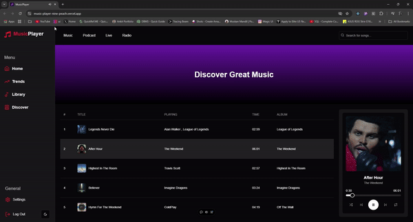

# Music Player

A modern, responsive music player built with React.js and Next.js. This application provides a sleek interface for browsing and playing music, with features like playlist management and real-time playback controls.

## Demo


## Features

- 🎵 Play, pause, skip, and control music playback
- 📊 Display song information including title, artist, and album
- 🖼️ Show album artwork for each track
- 📱 Responsive design for various screen sizes
- 🎨 Sleek, dark-themed UI inspired by popular music streaming services
- 📜 Playlist management with drag-and-drop reordering (coming soon)
  
## Installation

If you wish to build the project locally and see what my website looks like, you can run the following command to first get my project on your system:

```bash
git clone https://github.com/AnkitSingh0702/Music_Player

cd Cosmic_Cubes
```
Install the dependencies:

```bash
npm install
```
start the development server:
```bash
npm run dev
# or
yarn dev
# or
pnpm dev
# or
bun dev
```

Open [http://localhost:3000](http://localhost:3000) with your browser to see the result.

You can start editing the page by modifying `app/page.tsx`. The page auto-updates as you edit the file.

This project uses [`next/font`](https://nextjs.org/docs/app/building-your-application/optimizing/fonts) to automatically optimize and load [Geist](https://vercel.com/font), a new font family for Vercel.

## Learn More

To learn more about Next.js, take a look at the following resources:

- [Next.js Documentation](https://nextjs.org/docs) - learn about Next.js features and API.
- [Learn Next.js](https://nextjs.org/learn) - an interactive Next.js tutorial.

You can check out [the Next.js GitHub repository](https://github.com/vercel/next.js) - your feedback and contributions are welcome!

## Deploy on Vercel

The easiest way to deploy your Next.js app is to use the [Vercel Platform](https://vercel.com/new?utm_medium=default-template&filter=next.js&utm_source=create-next-app&utm_campaign=create-next-app-readme) from the creators of Next.js.

Check out our [Next.js deployment documentation](https://nextjs.org/docs/app/building-your-application/deploying) for more details.
